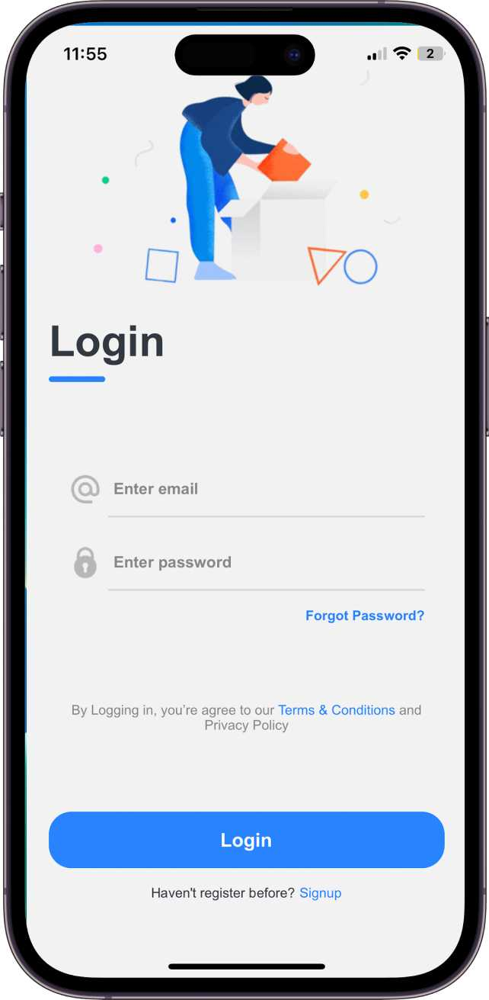
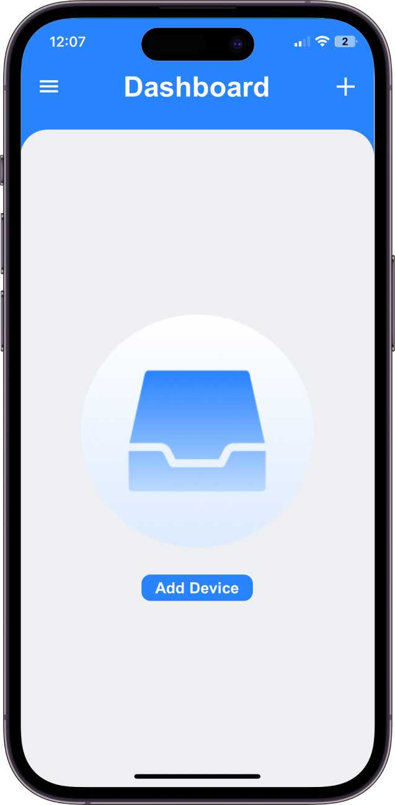
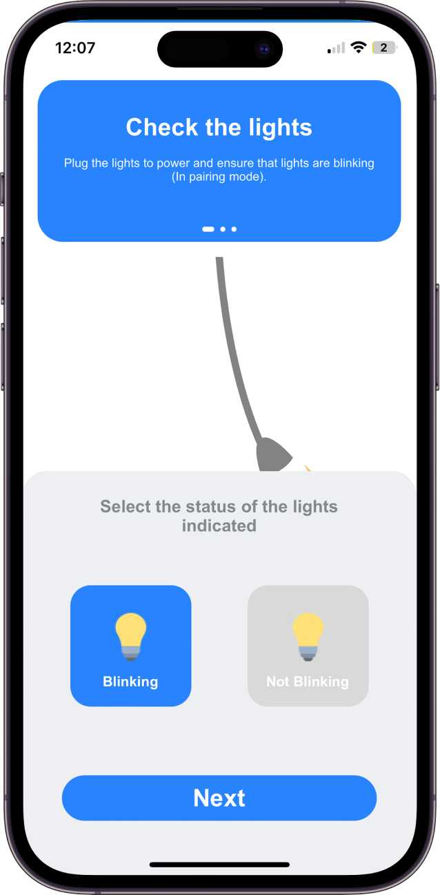
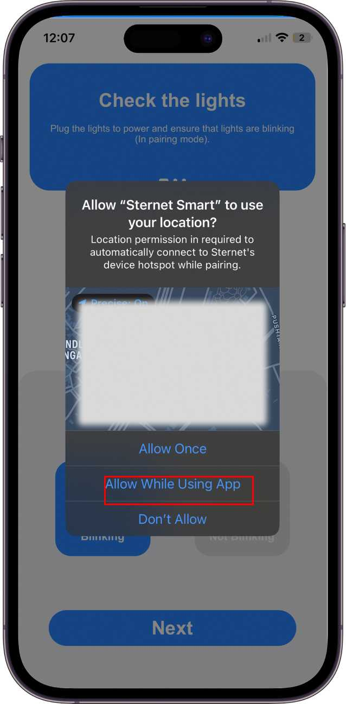
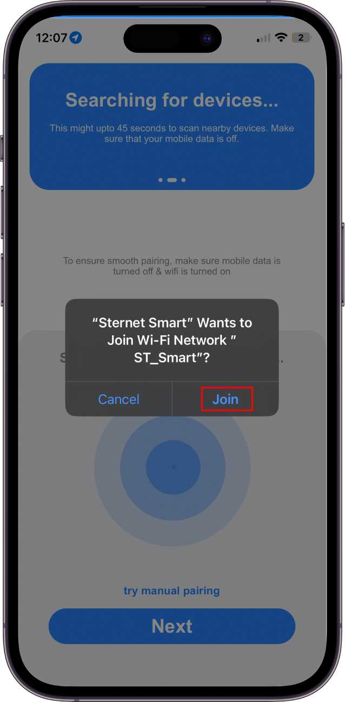
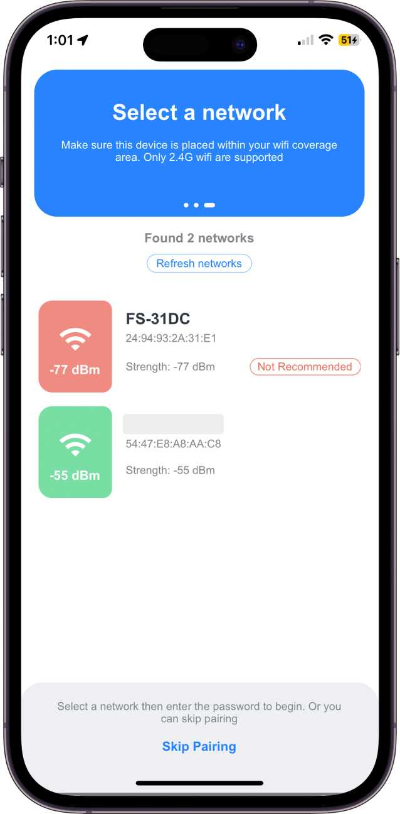
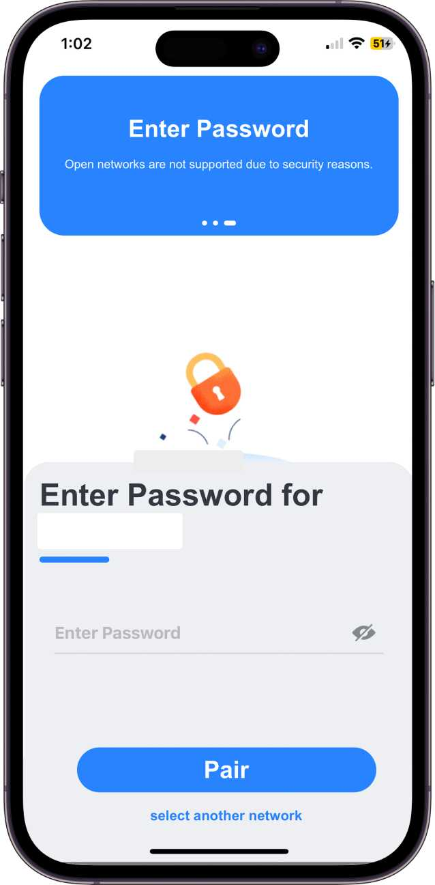
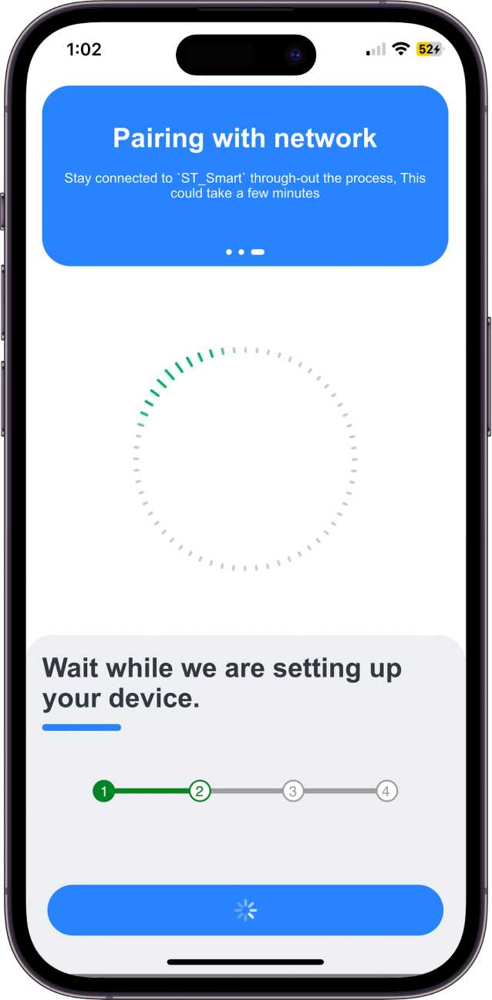
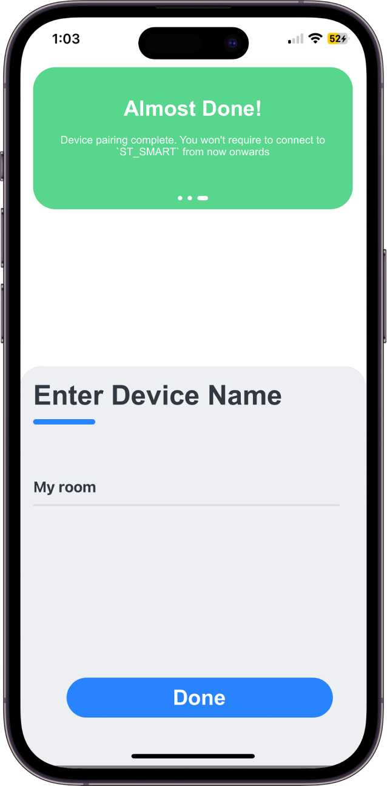
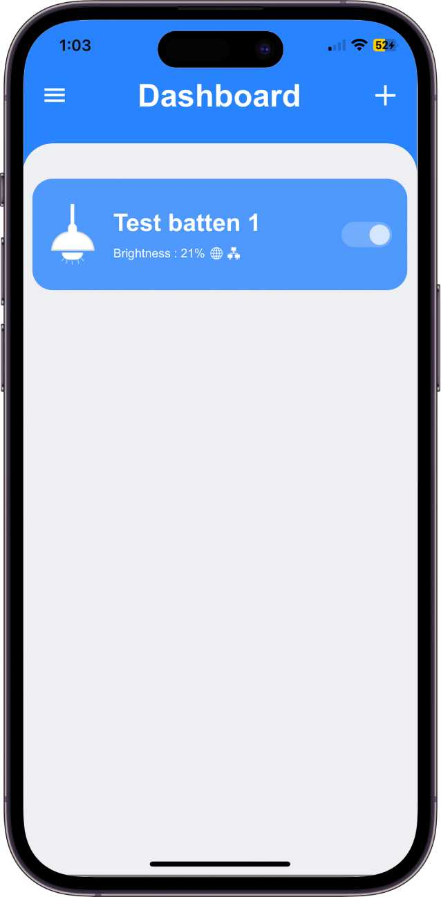

# How to Pair with Sternet Smart App

## Step 1: Download the Huelite Application

Download the Huelite Application from Play Store/App Store respectively.

- Sternet Smart [app](#) for iOS
- Sternet Smart [app](https://play.google.com/store/apps/details?id=com.sternet.sternetsmart&pcampaignid=web_share) for Android

    

## Step 2: Install and Register

Once the app is installed, register an account with Sternet, or login with an existing account.

    

        
    

    

        
    

#### Step 3: Tap on “+” sign top right corner or “Add Device” button as shown below.

  

    
  

#### Step 4: Ensure the switch is turned ON and the Sternet Smart Device is blinking, then tap the 'Next' button.

  

    
  

#### Step 5: Allow location access to the Aternet Smart application and enable your phone to connect to the Sternet device hotspot, i.e., `ST_Smart` WiFi.

    

         
    

    

 
    

Make sure mobile data is turned off & the distance between the LED batten and home Wi-Fi shouldn’t be greater than 4 meters while pairing. <a href="/support/pairing-troubleshoot">Not able to proceed forward?</a>

#### Step 6: Upon successful configuration, a list of Wi-Fi networks will appear. Choose your 2.4GHz Wi-Fi and enter the password.

    

    
    

    

 
    

### Only 2.4G wifi is supported with WPA/WPA2 encryption security. Ensure following points

- Make sure the phone should be connected with “ST_Smart” Wi-Fi while entering the password. If not, connect manually and then enter the home network password.

- Make sure that only one unpaired device is ON at a time.

- The signal range of the home network should be greater than -60dB for a smooth connectivity experience. If the signal is weak, you’ll need a WiFi extender.

- Open networks are not supported. Consider choosing a WiFi network with WPA/WPA2 password encryption scheme.
  

  #### Step 7: Now wait up to 45 seconds, and let the device connect automatically.

 

  

    
  

  #### Step 8: Successful configuration will appear. Set the name of the lights. Afterward, you will be directed to the Smart Light Dashboard.

  

  

    
  

  

    
  

#### **Your device is successfully paired! Enjoy!!**
 